# 📅 Fecha Manual en Ventas - Documentación

## 🎯 Propósito

Permite a ciertos clientes registrar ventas con **fechas personalizadas**, ideal para:
- ✅ Migrar datos históricos de cuadernos/Excel
- ✅ Registrar ventas de días/meses anteriores
- ✅ Completar registros pendientes

## 🔒 Seguridad

- **Desactivado por defecto** en todas las bases de datos
- Solo **SUPER_ADMIN** puede activarlo/desactivarlo
- Validaciones automáticas:
  - ❌ No permite fechas futuras
  - ❌ Requiere permiso explícito del sistema
  - ✅ Registra auditoría de uso

---d

## 🚀 Cómo Activar (SUPER_ADMIN)

### Opción 1: Desde la API (Recomendado)

```bash
# 1. Crear el parámetro (si no existe)
POST /api/system-parameters/initialize

# 2. Activar la funcionalidad
PUT /api/system-parameters/allow_manual_sale_date
{
  "parameterValue": true
}

# 3. Verificar estado
GET /api/system-parameters/pos/manual-sale-date-enabled
```

### Opción 2: SQL Directo (Railway/PostgreSQL)

```bash
# En Railway
railway link  # Si no está enlazado
railway run psql -c "
  UPDATE system_parameters 
  SET parameter_value = true, updated_at = NOW() 
  WHERE parameter_key = 'allow_manual_sale_date';
"

# O usar los scripts incluidos:
railway run psql < enable-manual-sale-date.sql
```

### Opción 3: Scripts SQL

```sql
-- Archivo: enable-manual-sale-date.sql
UPDATE "system_parameters"
SET 
  "parameter_value" = true,
  "updated_at" = NOW()
WHERE "parameter_key" = 'allow_manual_sale_date';
```

---

## 📱 Cómo Usar (Frontend)

### 1. Verificar si está habilitado

```typescript
// En el componente POS
const checkManualDateEnabled = async () => {
  const response = await api.get('/system-parameters/pos/manual-sale-date-enabled');
  setManualDateEnabled(response.data.enabled);
};
```

### 2. Mostrar campo de fecha

```tsx
{manualDateEnabled && (
  <Form.Item
    label="Fecha de la Venta"
    name="saleDate"
    tooltip="Selecciona la fecha real de la venta"
  >
    <DatePicker 
      format="DD/MM/YYYY"
      disabledDate={(current) => {
        // No permitir fechas futuras
        return current && current > dayjs().endOf('day');
      }}
      placeholder="Seleccionar fecha"
    />
  </Form.Item>
)}
```

### 3. Enviar con fecha

```typescript
const createSale = async (values) => {
  const saleData = {
    ...values,
    date: values.saleDate ? values.saleDate.format('YYYY-MM-DD') : undefined,
    // ... otros campos
  };
  
  await api.post('/sales', saleData);
};
```

---

## 🧪 Testing

### Test 1: Verificar que está desactivado por defecto

```bash
GET /api/system-parameters/pos/manual-sale-date-enabled

# Esperado: { "success": true, "enabled": false }
```

### Test 2: Intentar crear venta con fecha (sin permiso)

```bash
POST /api/sales
{
  "date": "2024-10-01",
  "totalAmount": 100000,
  ...
}

# Esperado: Error 400 - "La selección manual de fecha no está habilitada"
```

### Test 3: Activar y crear venta con fecha

```bash
# 1. Activar
PUT /api/system-parameters/allow_manual_sale_date
{ "parameterValue": true }

# 2. Crear venta
POST /api/sales
{
  "date": "2024-10-15",
  "totalAmount": 100000,
  ...
}

# Esperado: Venta creada con fecha 2024-10-15
```

### Test 4: Fecha futura (debe fallar)

```bash
POST /api/sales
{
  "date": "2025-12-31",  // Fecha futura
  ...
}

# Esperado: Error 400 - "No se pueden registrar ventas con fecha futura"
```

---

## 🎨 Implementación Frontend Completa

### Componente POS con Fecha Manual

```tsx
import { useState, useEffect } from 'react';
import { Form, DatePicker, Alert, Switch } from 'antd';
import dayjs from 'dayjs';
import api from '../services/api';

const POSPage = () => {
  const [form] = Form.useForm();
  const [manualDateEnabled, setManualDateEnabled] = useState(false);
  const [useManualDate, setUseManualDate] = useState(false);

  useEffect(() => {
    // Verificar si está habilitado
    const checkManualDate = async () => {
      try {
        const res = await api.get('/system-parameters/pos/manual-sale-date-enabled');
        setManualDateEnabled(res.data.enabled);
      } catch (error) {
        console.error('Error verificando fecha manual:', error);
      }
    };
    checkManualDate();
  }, []);

  const handleSubmit = async (values) => {
    const saleData = {
      ...values,
      // Solo incluir fecha si está habilitado y el usuario quiere usarla
      date: useManualDate && values.saleDate 
        ? values.saleDate.format('YYYY-MM-DD') 
        : undefined,
    };

    try {
      await api.post('/sales', saleData);
      message.success('Venta registrada exitosamente');
      form.resetFields();
      setUseManualDate(false);
    } catch (error) {
      message.error(error.response?.data?.message || 'Error al registrar venta');
    }
  };

  return (
    <Form form={form} onFinish={handleSubmit}>
      {/* Mostrar alerta si está habilitado */}
      {manualDateEnabled && (
        <Alert
          type="warning"
          message="Modo de Migración Activo"
          description="Puedes registrar ventas con fechas personalizadas"
          showIcon
          closable
          style={{ marginBottom: 16 }}
        />
      )}

      {/* Switch para activar/desactivar fecha manual */}
      {manualDateEnabled && (
        <Form.Item label="Usar fecha personalizada">
          <Switch 
            checked={useManualDate} 
            onChange={setUseManualDate}
            checkedChildren="Sí"
            unCheckedChildren="No"
          />
        </Form.Item>
      )}

      {/* Campo de fecha (solo si está activado) */}
      {manualDateEnabled && useManualDate && (
        <Form.Item
          label="Fecha de la Venta"
          name="saleDate"
          rules={[{ required: true, message: 'Selecciona la fecha' }]}
          tooltip="Fecha real en que se realizó la venta"
        >
          <DatePicker 
            format="DD/MM/YYYY"
            disabledDate={(current) => {
              return current && current > dayjs().endOf('day');
            }}
            placeholder="Seleccionar fecha"
            style={{ width: '100%' }}
          />
        </Form.Item>
      )}

      {/* ... resto del formulario ... */}
    </Form>
  );
};
```

---

## 🛡️ Validaciones Backend

```typescript
// En sale.service.ts

async create(data: CreateSaleDto) {
  // 1. Validar si se permite fecha manual
  if (data.date) {
    const isManualDateAllowed = await this.systemParametersService
      .isManualSaleDateEnabled();
    
    if (!isManualDateAllowed) {
      throw new BadRequestException(
        'La selección manual de fecha no está habilitada'
      );
    }
    
    // 2. Validar que no sea fecha futura
    const saleDate = parseLocalDate(data.date);
    const today = new Date();
    today.setHours(23, 59, 59, 999);
    
    if (saleDate > today) {
      throw new BadRequestException(
        'No se pueden registrar ventas con fecha futura'
      );
    }
  }
  
  // ... continuar con creación normal
}
```

---

## 📊 Casos de Uso

### Caso 1: Cliente con Ventas en Cuaderno

**Situación**: Cliente tiene ventas de octubre en cuaderno y ahora usa el sistema.

**Solución**:
1. SUPER_ADMIN activa `allow_manual_sale_date`
2. Usuario registra ventas del 1-31 de octubre con fechas correctas
3. SUPER_ADMIN desactiva el parámetro
4. Sistema vuelve a modo normal

### Caso 2: Completar Día Anterior

**Situación**: Olvidaron registrar ventas de ayer.

**Solución**:
1. Activar temporalmente
2. Registrar ventas con fecha de ayer
3. Desactivar

### Caso 3: Migración Masiva

**Situación**: Cliente nuevo con 3 meses de historial.

**Solución**:
1. Activar parámetro
2. Importar CSV/Excel con fechas
3. Verificar datos
4. Desactivar parámetro

---

## ⚠️ Advertencias

### ❌ NO Usar Para:
- Ventas del día actual (usar modo normal)
- Modificar fechas de ventas ya registradas
- Evitar cierres de caja

### ✅ SÍ Usar Para:
- Migración de datos históricos
- Completar registros pendientes
- Situaciones especiales aprobadas

### 🔒 Recomendaciones:
1. **Activar solo temporalmente** (mientras se migra data)
2. **Desactivar inmediatamente** después de completar
3. **Documentar** qué ventas se registraron manualmente
4. **Verificar** reportes después de migración

---

## 🔄 Workflow Recomendado

```mermaid
graph TD
    A[Cliente necesita migrar datos] --> B[SUPER_ADMIN activa parámetro]
    B --> C[Frontend muestra campo de fecha]
    C --> D[Usuario registra ventas con fechas]
    D --> E{¿Migración completa?}
    E -->|No| D
    E -->|Sí| F[SUPER_ADMIN desactiva parámetro]
    F --> G[Sistema vuelve a modo normal]
    G --> H[Verificar reportes]
```



---

## 📝 Auditoría

Cada venta con fecha manual se registra normalmente pero puede ser identificada porque:
- Su `date` difiere de `createdAt`
- Se puede filtrar por rango de fechas

```sql
-- Encontrar ventas con fecha manual
SELECT 
  id,
  date as sale_date,
  "createdAt" as registered_at,
  "totalAmount",
  CASE 
    WHEN DATE(date) != DATE("createdAt") THEN 'Manual'
    ELSE 'Normal'
  END as type
FROM "Sale"
WHERE DATE(date) != DATE("createdAt")
ORDER BY date DESC;
```

---

## 🆘 Troubleshooting

### Error: "La selección manual de fecha no está habilitada"

**Causa**: Parámetro desactivado

**Solución**:
```bash
railway run psql < enable-manual-sale-date.sql
```

### Error: "No se pueden registrar ventas con fecha futura"

**Causa**: Fecha seleccionada es posterior a hoy

**Solución**: Seleccionar fecha válida (hoy o anterior)

### No aparece campo de fecha en frontend

**Causa**: 
1. Parámetro no habilitado
2. Cache de parámetros

**Solución**:
```bash
# Limpiar cache
POST /api/system-parameters/cache/clear
```

---

## ✅ Checklist de Activación

- [ ] Verificar que el parámetro existe en BD
- [ ] Activar parámetro (`parameter_value = true`)
- [ ] Limpiar cache de parámetros
- [ ] Verificar endpoint: `/pos/manual-sale-date-enabled`
- [ ] Frontend muestra campo de fecha
- [ ] Crear venta de prueba con fecha
- [ ] Verificar que se guardó con fecha correcta
- [ ] Documentar en bitácora del cliente

---

**Implementado**: Octubre 2025  
**Versión**: 1.0  
**Autor**: Sistema de Parámetros
